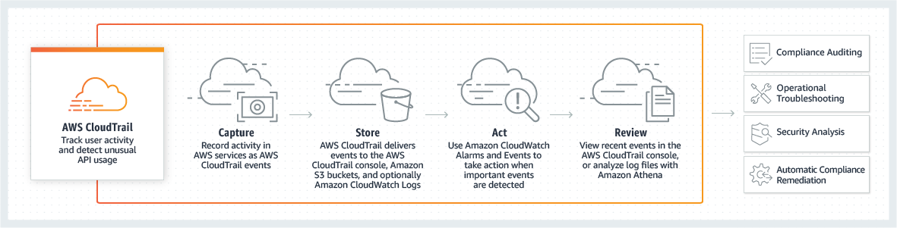
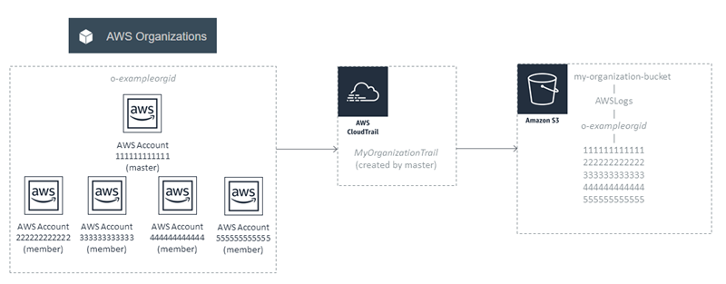
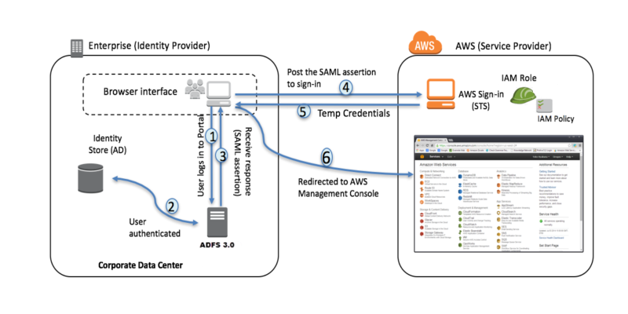
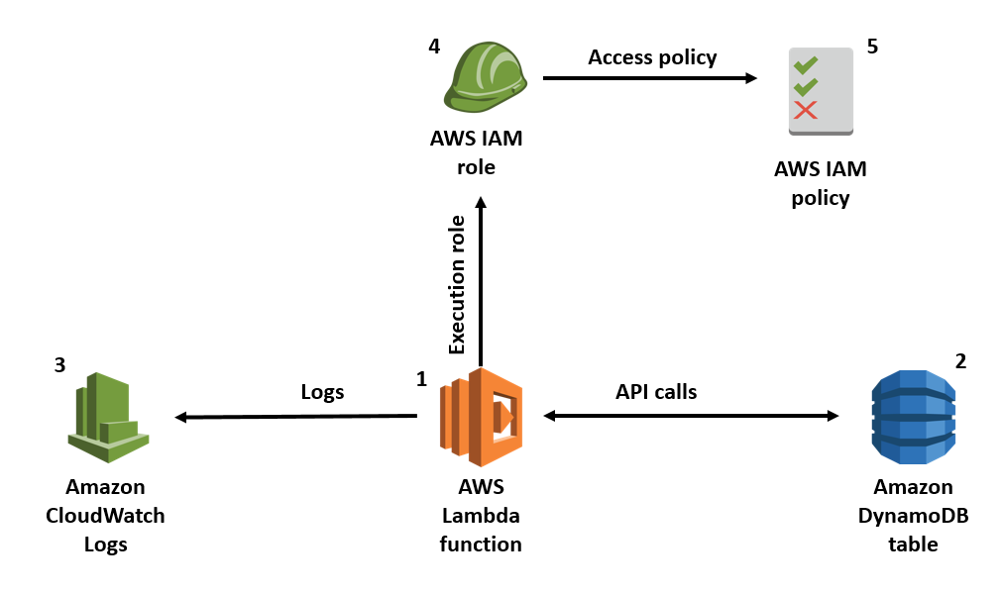

# AWS Security Funtime

- [AWS Trusted Advisor](#aws-trusted-advisor)
- [AWS Config](#aws-config)
- [Amazon Inspector](#amazon-inspector)
- [AWS VPC](#aws-vpc)
- [AWS CloudTrail](#aws-cloudtrail)
- [AWS CloudWatch](#aws-cloudwatch)
- [AWS GuardDuty](#aws-guardduty)
- [AWS KMS](#aws-kms)
- [AWS Systems Manager](#aws-systems-manager)
- [AWS ElastiCache](#aws-elasticache)
- [AWS IAM](#aws-iam)
- [AWS EC2](#aws-ec2)
- [Attempt Log](#attempt-log)
- [AWS Marketplace](#aws-marketplace)
- [AWS Lambda](#aws-lambda)
- [Athena](#athena)
- [Test Ideas](#test-ideas)
- [Next Up](#next-up)
- [Attempt Log](#attempt-log)

## AWS Trusted Advisor
- Checks Security Groups for rules that allow unrestricted access (0.0.0.0/0) to specific ports such as SSH. 
  - [AWS Config](#aws-config) can alert you to any _modifications_ to a Security Group but out of the box, it will not perform a check for _unrestricted access_.
  - Ports flagged green are typically used by applications that require unrestricted access, such as HTTP and SMTP.
- Other core best practice checks:
  - S3 Bucket Permissions
  - IAM Use
  - MFA on Root Account
  - EBS Public Snapshots
  - RDS Public Snapshots

## AWS Config
- [AWS Config FAQ](https://aws.amazon.com/config/faq/)
- You can send notifications or take automated action with Lambda when a resource violates a rule.


## Amazon Inspector
- [Inspector FAQ](https://aws.amazon.com/inspector/faqs/)
- The runtime behavior package checks for insecure protocols like Telnet, FTP, HTTP, IMAP, rlogin etc. 
- Neither the AWS Config restricted-common-ports check or Trusted Advisor will give you this information.

## AWS VPC
### Flow Logs
- VPC Flow Logs enables you to capture information about the IP traffic going to and from network interfaces in your VPC. 
- Flow log data can be published to Amazon CloudWatch Logs and Amazon S3.
- Flow logs can help you with a number of tasks:
  - Diagnosing overly restrictive security group rules
  - Monitoring the traffic that is reaching your instance
  - Determining the direction of the traffic to and from the network interfaces
  - Aiding in investigating suspicius traffic
### DNS servers
- The default DHCP option set specifies AmazonProvidedDNS but you can provide the IP address of up to 4 of your own DNS servers. 
- You cannot update the existing option set, you must delete it and create a new one.
### Security groups
- Security groups are stateful, if you have allowed the inbound traffic you do not need to create a rule to allow the outbound reply. 
- By default an SG allows any outbound traffic so you don't need to add an outbound rule to a server in a public subnet.
### AWS Direct Connect
- With AWS Direct Connect plus VPN, you can combine one or more AWS Direct Connect dedicated network connections with the Amazon VPC VPN. 
- This combination provides an IPsec-encrypted private connection that also reduces network costs, increases bandwidth throughput, and provides a more consistent network experience than internet-based VPN connections.


## AWS CloudTrail
- [AWS CloudTrail FAQ](https://aws.amazon.com/cloudtrail/faqs/)
- CloudTrail provides event history of your AWS account activity, including actions taken through the AWS Management Console, AWS SDKs, command line tools, and other AWS services.
- It is recommended to use a dedicated S3 bucket for CloudTrail logs. 
- CloudTrail can also send logs to CloudWatch Logs, which can then trigger CloudWatch Events

### Multiple accounts
- Within an AWS Organization, you can create one CloudTrail to cover all accounts.

### Management and data events
- Management and Data events are handled by separate CloudTrails. 
  - **Data Events**: operations on or within a resource
		- Often high-volume
		- Disabled by default
		- You must explicitly add the supported resources or resource types for which you want to collect activity to a trail.
  - **Management Events**: Configuration or security changes
  - You should log the events to separate buckets, then configure access to the CloudTrail and read only access to the S3 bucket using an IAM policy attached to the user or group. 
### Regions
- When you apply a trail to all regions, CloudTrail uses the trail that you create in a particular region to create trails with identical configurations in all other regions in your account. 
### Integrity
- To determine whether a log file was modified, deleted, or unchanged after CloudTrail delivered it, you can use CloudTrail log file integrity validation.

## AWS CloudWatch
- [CloudWatch FAQ](https://aws.amazon.com/cloudwatch/faqs/)
- You can use Amazon CloudWatch Logs to monitor, store, and access your log files from EC2 instances, AWS CloudTrail, Route 53, and other sources. 
- CloudWatch alone lacks the business rules that are provided with GuardDuty to create an event whenever malicious or unauthorized behavior is observed.
	- GuardDuty can trigger CloudWatch Events which can then be used for a variety of activities like notifications or automatically responding to a threat.
- If an anomaly is detect, CloudWatch Event can trigger a Lambda.
### CloudWatch Logs
- You can use Amazon CloudWatch Logs to monitor, store, and access your log files from EC2 instances, AWS CloudTrail, Route 53, and other sources. 
- You can then retrieve the associated log data from CloudWatch Logs.
### CloudWatch Events
- You can use CloudWatch Events to schedule automated actions that self-trigger at certain times using cron or rate expressions.
- You can configure Amazon Inspector as a target for CloudWatch Events. 

## AWS GuardDuty
- [GuardDuty FAQ](https://aws.amazon.com/guardduty/faqs/)
- It is a managed service that can watch CloudTrail, VPC Flow Logs and DNS Logs, watching for malicious activity. 
- It can detect instances exhibiting signs of compromise, such as: 
  - Attempting to communicate with a command and control server.
  - Behaving as a spam bot with email traffic over port 25.
  - Sending requests that look like it is part of a DoS attack
  - [GuardDuty Backdoor](https://docs.aws.amazon.com/guardduty/latest/ug/guardduty_backdoor.html)
- It has a build-in list of suspect IP addresses and you can also upload your own lists of IPs.
- GuardDuty can trigger CloudWatch Events which can then be used for a variety of activities like notifications or automatically responding to a threat.

## AWS KMS
### CMK
- Imported key material
  - Automatic key rotation is not available for CMKs that have imported key material, you will need to do this manually.
- Customer managed keys
  - A customer managed CMK supports automatic key rotation once per year. 
  - Creating and managing your own CMK gives you more flexibility, including the ability to create, rotate, disable, and define access controls, and to audit the encryption keys used to protect your data. 
- AWS managed keys 
  - AWS managed keys automatically rotate once every three years.

## AWS Systems Manager 
### Parameter Store
- Services that support parameter store:
  - Amazon EC2
  - Amazon ECS
  - AWS Lambda
    - If a service does not directly support it (e.g., RDS), just **use Lambda in association with the service**
  - AWS CloudFormation
  - AWS CodeBuild
  - AWS CodeDeploy
- Configure integration with the following AWS services for encryption, notification, monitoring, and auditing:
  - Amazon SNS
  - Amazon CloudWatch
  - AWS CloudTrail
  - AWS KMS
    - An instance role needs permission both to read an SSM parameter and to use KMS to decrypt it.
    - Parameter Store uses KMS customer master keys to encrypt the parameter values when you create or change them.
    - Parameter Store supports only symmetric CMKs. You cannot use asymmetric CMKs to encrypt your parameters.


### Patch Manager
- The default predefined patch baseline for Windows servers in Patch Manager is `AWS-DefaultPatchBaseline`.

## AWS ElastiCache
- Supports encryption only for Redis 3.2.6, 4.0.10 and later, not Memcached.

## AWS IAM
### Account Compromise
- If you suspect that your account is compromised, do the following:
  - Change your AWS account root user password.
  - Rotate and delete all root and AWS Identity and Access Management (IAM) access keys.
  - Delete any potentially compromised IAM users, and change the password for all other IAM users.
  - Delete any resources on your account you didn't create, such as EC2 instances and AMIs, EBS volumes and snapshots, and IAM users.
  - Respond to any notifications you received from AWS Support through the AWS Support Center.
### Policy evaluation logic
1. The AWS service receives the request
2. AWS first authenticates the principal.
    - Except for services such as S3 that allow anonymous access). 
3. Next, AWS determines which policy to apply to the request. 
    - Actions (or operations) – The actions or operations that the principal wants to perform.
    - Resources – The AWS resource object upon which the actions or operations are performed.
    - Principal – The user, role, federated user, or application that sent the request. Information about the principal includes the policies that are associated with that principal.
    - Environment data – Information about the IP address, user agent, SSL enabled status, or the time of day.
    - Resource data – Data related to the resource that is being requested. This can include information such as a DynamoDB table name or a tag on an Amazon EC2 instance.
4. Then, AWS evaluates the policy types and arranges an order of evaluation. 
    - Identity-based policies
    - Resource-based policies
    - IAM permissions boundaries
    - AWS Organizations service control policies (SCPs)
    - Session policies (e.g. for federated user sessions)
5. Finally, AWS then processes the policies against the request context to determine if it is allowed.

### ADFS

1. Corporate user accesses the corporate Active Directory Federation Services portal sign-in page and provides Active Directory authentication credentials.
2. AD FS authenticates the user against Active Directory.
3. Active Directory returns the user’s information, including AD group membership information.
4. AD FS dynamically builds ARNs by using Active Directory group memberships for the IAM roles and user attributes for the AWS account IDs, and sends a signed assertion to the users browser with a redirect to post the assertion to AWS STS.
5. Temporary credentials are returned using STS AssumeRoleWithSAML.
6. The user is authenticated and provided access to the AWS management console.

## AWS EC2
- If you connect to your instance using SSH and get any of the following errors, "Host key not found in `[directory]`", "Permission denied (publickey)", or "Authentication failed, permission denied", verify that you are connecting with the appropriate user name for your AMI *and* that you have specified the proper private key (.pem) file for your instance.
- If you lose the private key for an EBS-backed instance, you can regain access to your instance. You must: 
1. stop the instance, 
2. detach its root volume and attach it to another instance as a data volume, 
3. modify the `authorized_keys` file, 
4. move the volume back to the original instance, and 
5. restart the instance.

## AWS Marketplace
### IDS/IPS
- AWS GuardDuty is not an IDS. While it does perform _threat_ detection based on logs, it does not detect _intrusion_. 
- AWS Shield is not an IPS. It mitigates DDoS attacks, but it does not prevent intrusion.
- AWS acknowledge that they do not provide IPS/IDS. 
  - Instead they suggest that third-party software can be used to provide additional functionality such as deep packet inspection, IPS/IDS, or network threat protection. 
  - Search for IPS on AWS Marketplace and you will find a range of suitable products!

## AWS Lambda
- [Lambda FAQ](https://aws.amazon.com/lambda/faqs/)
- For Lambda to send logs to CloudWatch, the function execution role needs to permission to write to CloudWatch.
- For Lambda to make API calls to DynamoDB, the function execution role needs many permissions to interact with DynamoDB.
```json
{
	"Version": "2012-10-17",
	"Statement": [{
			"Effect": "Allow",
			"Action": [
				"dynamodb:BatchGetItem",
				"dynamodb:GetItem",
				"dynamodb:Query",
				"dynamodb:Scan",
				"dynamodb:BatchWriteItem",
				"dynamodb:PutItem",
				"dynamodb:UpdateItem"
			],
			"Resource": "arn:aws:dynamodb:eu-west-1:123456789012:table/SampleTable"
		},
		{
			"Effect": "Allow",
			"Action": [
				"logs:CreateLogStream",
				"logs:PutLogEvents"
			],
			"Resource": "arn:aws:logs:eu-west-1:123456789012:*"
		},
		{
			"Effect": "Allow",
			"Action": "logs:CreateLogGroup",
			"Resource": "*"
		}
	]
}
```


## Athena
- [Athena FAQ](https://aws.amazon.com/athena/faqs/)

## Test Ideas
- Try out Trusted Advisor vs AWS Config vs AWS Inspector vs CloudWatch Agent for detecting: 
  - Install a CloudWatch agent on EC2 and use Parameter Store [like so](https://docs.aws.amazon.com/AmazonCloudWatch/latest/monitoring/create-iam-roles-for-cloudwatch-agent.html)
  - An open SSH port:
    - Does Trusted Advisor catch the exposure?
    - Does Inspector detect the port?
    - If a Config rule is set, and a notification created, does Config notice the exposure?
    - If a Config Lambda is set and configuration changes, does Config close the port?
  - An open HTTP (not HTTPS) port:
    - Does Trusted Advisor catch the exposure?
    - Does Inspector detect the port?
    - If a Config rule is set, and a notification created, does Config notice the exposure?
    - If a Config Lambda is set and configuration changes, does Config close the port?
  - Put behind CloudFront, see if errors occur
  - Turn on TLS for CloudFront
  - Check for errors in CloudWatch
- Set up a DB in RDS with secrets stored in Secrets Manager connected to EC2
  - Provide the EC2 instance access to read SM
	- Rotate secrets with AWS SM
	- Encrypt the EBS volume
	- Simulate lost private key for EC2
- Try out VPC Flow Logs going to S3 vs CloudWatch Logs
  - Observe SSH traffic
  - Observe HTTP traffic
  - Create an HTTP redirect to HTTPS and observe
- Set up GuardDuty to trigger CloudWatch Events and Lambda
- Set up Lambda to modify DynamoDB and send logs to CloudWatch [like so](https://aws.amazon.com/blogs/security/how-to-create-an-aws-iam-policy-to-grant-aws-lambda-access-to-an-amazon-dynamodb-table/)
- Create multiple accounts under AWS Organization
  - Create top-level CloudTrails for data and management events, send each to separate S3s
  - Query S3s with Athena
  - send data events to CloudWatch Logs
  - send management events to CloudWatch Events with an alert for IAM changes and changes to encryption
  - Limit permissions for the S3 to one auditor
  - Encrypt the log files in S3--try SSE-S3, then SSE-KMS
	- Create a KMS grant for another account
	- Use that account to use the CMK
	- Revoke the grant
  - Check logs after changes

## Attempt Log
1. 65%
2. 77%
3. 89%
4.
(>90% needed to take official practice)

## Next Up
- [x] ~Restructure notes under services~
- [x] ~Create diagram for policy evaluation~
- [x] ~Distinguish Inspector, GuardDuty, Config, and Trusted Advisor~
  - [x] [Backdoor Finding](https://docs.aws.amazon.com/guardduty/latest/ug/guardduty_backdoor.html)
  - [x] [Trusted Advisor](https://aws.amazon.com/premiumsupport/technology/trusted-advisor/)
  - [x] [How Config Works](https://docs.aws.amazon.com/config/latest/developerguide/how-does-config-work.html)
  - [x] [Amazon Inspector FAQ](https://aws.amazon.com/inspector/faqs/)
  - [x] [GuardDuty FAQ](https://aws.amazon.com/guardduty/faqs/)
- [x] ~Distinguish CloudTrail, CloudWatch, GuardDuty, and VPC Flow Logs with table or diagram~
  - [x] [VPC Flow Logs](https://docs.aws.amazon.com/vpc/latest/userguide/flow-logs.html)
  - [x] [CloudTrail](https://docs.aws.amazon.com/awscloudtrail/latest/userguide/cloudtrail-user-guide.html)
  - [x] [CloudTrail 2](https://aws.amazon.com/cloudtrail/)
  - [x] [CloudTrail FAQ](https://aws.amazon.com/cloudtrail/faqs/)
  - [x] [CloudTrail Integrity](https://docs.aws.amazon.com/awscloudtrail/latest/userguide/cloudtrail-log-file-validation-intro.html)
  - [x] [CloudTrail for Orgs](https://docs.aws.amazon.com/awscloudtrail/latest/userguide/creating-trail-organization.html)
  - [x] [Athena x CloudTrail](https://docs.aws.amazon.com/athena/latest/ug/cloudtrail-logs.html)
  - [x] [Permissions for CloudTrail](https://docs.aws.amazon.com/awscloudtrail/latest/userguide/control-user-permissions-for-cloudtrail.html)
  - [x] [Encryption CloudTrail Log Files](https://docs.aws.amazon.com/awscloudtrail/latest/userguide/encrypting-cloudtrail-log-files-with-aws-kms.html)
  - [x] [CloudWatch Logs](https://docs.aws.amazon.com/AmazonCloudWatch/latest/logs/WhatIsCloudWatchLogs.html)
  - [x] [CloudWatch Agent](https://docs.aws.amazon.com/AmazonCloudWatch/latest/monitoring/Install-CloudWatch-Agent.html)
  - [x] [CloudWatch Agent x IAM](https://docs.aws.amazon.com/AmazonCloudWatch/latest/monitoring/create-iam-roles-for-cloudwatch-agent.html)
- [x] ~Create diagrams or mnemonics or 1-3 bullet points for special cases:~
  - [x] [AWS Direct Connect Plus VPN](https://docs.aws.amazon.com/whitepapers/latest/aws-vpc-connectivity-options/aws-direct-connect-plus-vpn-network-to-amazon.html)
  - [x] [SSM Parameter Store](https://docs.aws.amazon.com/kms/latest/developerguide/services-parameter-store.html)
  - [x] [Lambda Access to DynamoDB](https://aws.amazon.com/blogs/security/how-to-create-an-aws-iam-policy-to-grant-aws-lambda-access-to-an-amazon-dynamodb-table/)
  - [x] [DDoS Whitepaper](https://d1.awsstatic.com/whitepapers/Security/DDoS_White_Paper.pdf)
  - [x] [Troubleshooting EC2 Connection](https://docs.aws.amazon.com/AWSEC2/latest/UserGuide/TroubleshootingInstancesConnecting.html)
  - [x] [Secrets Manager And Resource Based Policies](https://docs.aws.amazon.com/secretsmanager/latest/userguide/auth-and-access_resource-based-policies.html)
  - [x] [Rotating Secrets](https://docs.aws.amazon.com/secretsmanager/latest/userguide/rotating-secrets.html)
  - [x] [KMS Grants](https://docs.aws.amazon.com/kms/latest/developerguide/grants.html)
  - [x] [EBS Encryption](https://docs.aws.amazon.com/AWSEC2/latest/UserGuide/EBSEncryption.html)
  - [x] [SSE-S3](https://docs.aws.amazon.com/AmazonS3/latest/dev/UsingServerSideEncryption.html)
  - [x] [SSE](https://docs.aws.amazon.com/AmazonS3/latest/dev/serv-side-encryption.html)
  - [x] [Memcached vs Redis](https://docs.aws.amazon.com/AmazonElastiCache/latest/mem-ug/SelectEngine.html)
  - [x] [ADFS](https://aws.amazon.com/blogs/security/aws-federated-authentication-with-active-directory-federation-services-ad-fs/)
  - [x] [Lambda Invocation Modes](https://docs.aws.amazon.com/lambda/latest/dg/invocation-eventsourcemapping.html)
  - [x] [Custom Origins](https://aws.amazon.com/premiumsupport/knowledge-center/custom-origin-cloudfront-fails/)
  - [x] [HTTPS Requirements](https://docs.aws.amazon.com/AmazonCloudFront/latest/DeveloperGuide/cnames-and-https-requirements.html#https-requirements-aws-region)
  - [x] [VPC DNS](https://docs.aws.amazon.com/vpc/latest/userguide/vpc-dns.html)
- [x] Review and remove unneeded notes
- [x] Attempt 3 (target: >80%)
- [x] Iterative control exercise
- [ ] Attempt 4 (target: >90%)
- [ ] Review and remove unneeded notes
- [ ] For each wrong or flagged questions:
   - [ ] Read and take 1-3 bullets
   - [ ] For wrong questions, also note answers if different from bullets
- [ ] Review video on how to prepare for official practice
- [ ] Official practice
- [ ] Review and remove unneeded notes
- [ ] For each question, research correct answer
